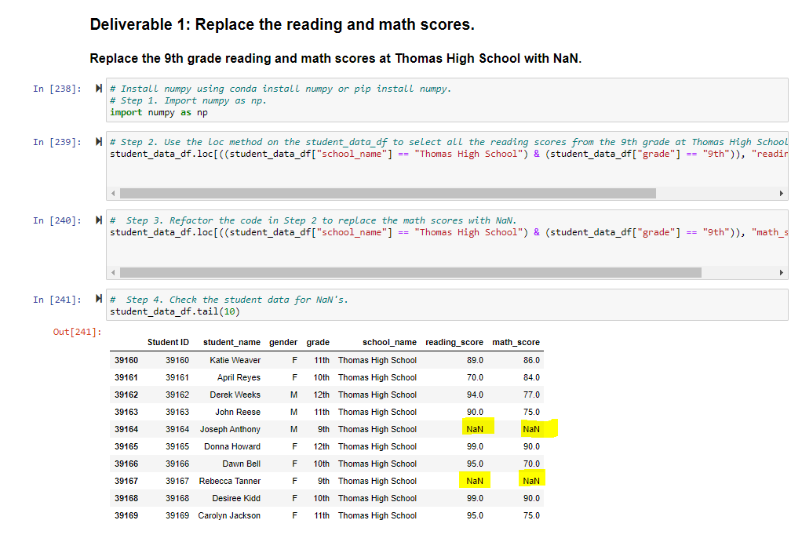
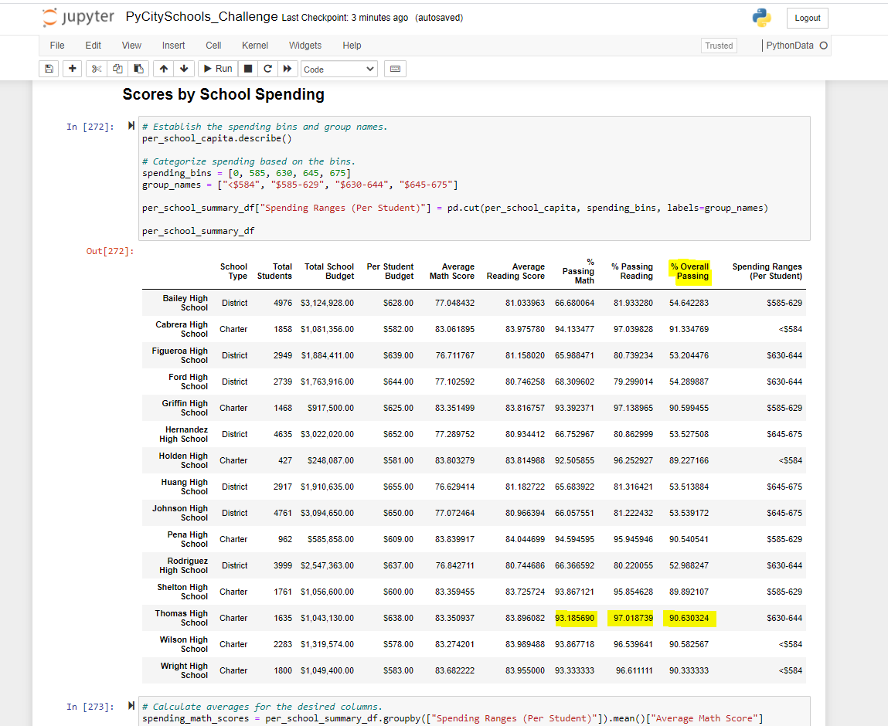
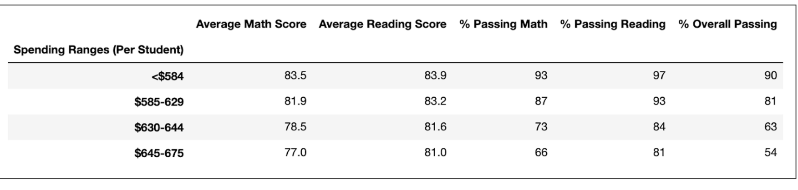

# School_District_Analysis
Python_Anaconda_Jupyter_Notebooks 
# Overview of the school district analysis: Explain the purpose of this analysis.

The purpose of this analysis is to analyze standardized test score data and school funding from a selection of schools to gauge school performance.

## Results

**How is the district summary affected?**
In the district summary of the "PyCitySchools_Challenge", the overall passing percentage was 64.9% while in the "PyCitySchools" module, the overall passing percentage was higher at 65.2%; a difference of 0.3%.

**How is the school summary affected?**
In the school summary of the "PyCitySchools_Challenge", the overall passing percentage was 90.6% while in the "PyCitySchools" module, the overall passing percentage was higher at 90.9%; a difference of 0.3%. The school data in the district is not evenly distributed, so Thomas High School in the Challenge had a better overall passing percentage of 90.6% when compared to the district inclusive of all schools. Combined overall passing percentage of all schools in the district, brought the overall passing percentage down to 64.9%.

**How does replacing the ninth graders’ math and reading scores affect Thomas High School’s performance relative to the other schools?**
Prior to replacing the math and reading scores for Thomas High School, these scores were relatively low and the overall passing percentage was at 65.1%. Upon replacing the scores for Thomas High School, Thomas High School’s performance was better relative to the other schools.

The Deliverable 1 image highlights where the ninth grade Reading and Math scores have been replaced with NaN:

The following image shows how the percentages for passing Math, passing Reading and overall passes increased:

**How does replacing the ninth-grade scores affect the following:**

 - **Math and reading scores by grade**
	-Replacing the ninth grade scores caused an overall increase in average.
 
- **Scores by school spending**
	- It was found that the overall passing percentage was the highest at 90% when the least amount of money was allocated per student; in this case, the spending range per student of less than $584 saw an overall passing percentage of 90%, while the highest spending range per student saw the lowest overall passing percentage of 54%. The following image demonstrates this finding:

 - **Scores by school size** 
	- The small school size saw a high overall passing percentage while the largest school size saw the lowest overall passing percentage. 

 - **Scores by school type**
	- Charter schools had a high overall passing percentage while District schools saw the lowest overall passing percentage. 

## Summary 
**Summarize four major changes in the updated school district analysis after reading and math scores for the ninth grade at Thomas High School have been replaced with NaNs.**

Four major changes:
1. Percentage passing Math increased for Thomas High School.
2. Percentage passing Reading increased for Thomas High School.
3. Percentage for Overall Passing increased for Thomas High School. 
4. Thomas High School now has a higher overall passing percentage of when compared to the district's overall passing percentage.
